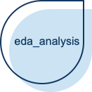
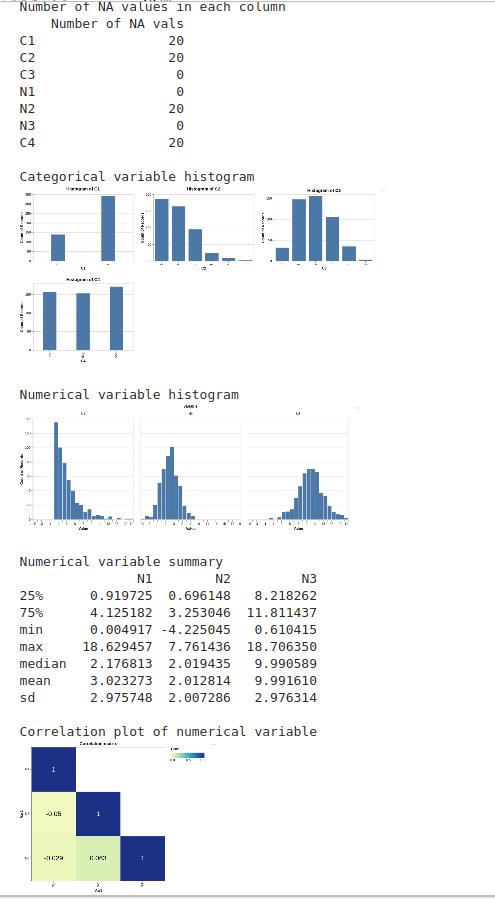

# A Package for Exploratory Data Analysis (eda_analysis)

 


 


Exploratory Data analysis is an important step in any data analysis. There are some general steps like describing the data, knowing `NA` values and plotting the distributions of the variables  which are performed to understand the data well. All these tasks require a lot of coding effort. The package tries to address this issue by providing a single function which will generate a general exploratory data analysis report. This report will contain the distribution plots of categorical and numerical variables, correlation matrix and a numerical and graphical representation to understand and identify `NA` values.

## Package positioning

This package helps in the EDA process of data analysis. There are other similar packages which can be used for EDA analysis. A package which does a similar thing is [pandas profiling](https://github.com/pandas-profiling/pandas-profiling). Pandas profiling creates an HTML report, but this package will give output in the ongoing code.

### Installation:

```
pip install -i https://test.pypi.org/simple/ eda_analysis
```

### Features

1. `calc_cor`: This function will take in dataframe and will plot correlation matrix of the features
2. `describe_na_values` : This function will take in data frame and will plot heat map to locate NA values in each feature and will also give a table listing number of NA values in each feature.
3. `describe_cat_var`: This function will take data frame and categorical variable names and will plot the histogram of each categorical variable
4. `describe_num_var`: This function will take data frame and numerical variable names and will plot the histogram of each numerical variable.
5. `generate_report`: This is a wrapper function which generates an EDA report by plotting graphs and tables for the numeric variables, categorical variables, NA values and correlation in a dataframe

### Dependencies

- python = ^3.7
- pandas = ^1.0.1
- numpy = ^1.18.1
- altair = ^4.0.1
- pytest-cov = ^2.8.1
- sphinx = ^2.4.4
- sphinxcontrib-napoleon = ^0.7
- poetry>=0.12

### Usage

To use eda_analysis in a project::

    from eda_analysis import eda_analysis
    
Visit our [read the docs page](https://edapython.readthedocs.io/en/latest/source/eda_analysis.html#module-eda_analysis) to see individual function usage.

### Examples

This is a working example:

```
import altair as alt
import numpy as np
import pandas as pd

def helper_create_data(n=500):
    """
    Helper function for creating dataframe for testing

    Parameters:
    -----------
    n: int (default value = 500)
        Number of rows to be generated for the dataframe

    Returns:
    --------
    pandas.DataFrame
        Returns a dataframe to be used for testing

    Examples:
    ---------
    >>> helper_create_data()
    """
    N1 = list(np.random.exponential(3, n))
    N2 = list(np.random.normal(2, 2, n))
    N3 = list(np.random.normal(10, 3, n))
    C1 = list(np.random.binomial(1, 0.7, n))
    C2 = list(np.random.poisson(1, n))
    C3 = list(np.random.binomial(5, 0.4, n))
    a = ['cat', 'dog', 'lion']
    C4 = list(np.random.choice(a, n))
    df = pd.DataFrame({
        'C1': C1,
        'C2': C2,
        'C3': C3,
        'N1': N1,
        'N2': N2,
        'N3': N3,
        'C4': C4
    })
    rows = list(np.random.randint(0, n, 20))
    cols = list(np.random.randint(0, 7, 5))
    df.iloc[rows, cols] = np.nan

    return df

data = helper_create_data()
cat_vars = ['C1', 'C2', 'C3', 'C4']
num_vars = ['N1', 'N2', 'N3']

generate_report(data,cat_vars,num_vars)
```




### Documentation
The official documentation is hosted on Read the Docs: <https://edapython.readthedocs.io/en/latest/>

### Credits
This package was created with Cookiecutter and the UBC-MDS/cookiecutter-ubc-mds project template, modified from the [pyOpenSci/cookiecutter-pyopensci](https://github.com/pyOpenSci/cookiecutter-pyopensci) project template and the [audreyr/cookiecutter-pypackage](https://github.com/audreyr/cookiecutter-pypackage).

